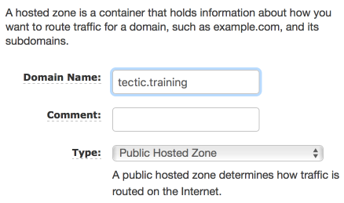
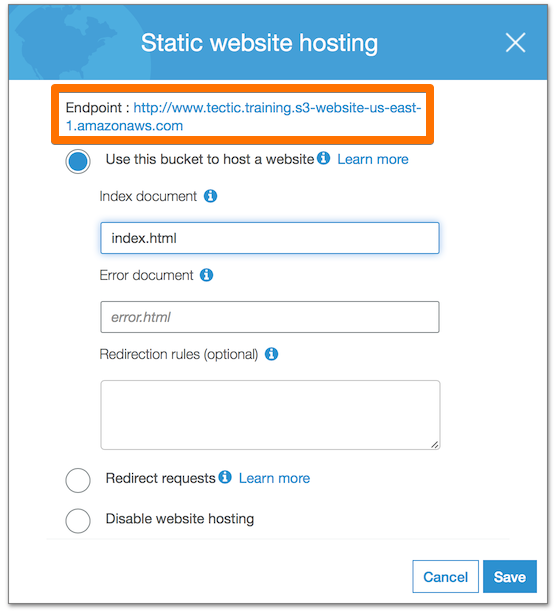
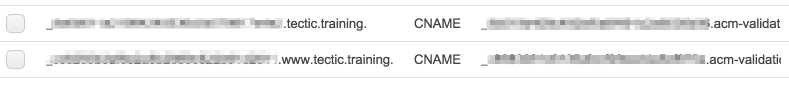
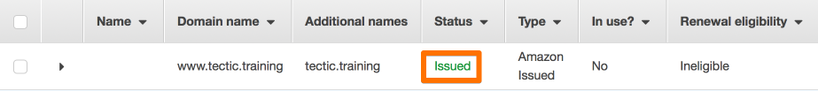

# Hosting with CloudFront and S3

## Overview

This course will cover setting up S3 and CloudFront for static website hosting on AWS. We’ll go over the steps manually, using the AWS console. As we proceed, some steps will have optional *Deeper Dive* sections that deliver a comprehensive understanding of the tasks.

> **_Important_**
>
> We'll be using the domain: `tectic.training` as a placeholder throughout this document.
> Replace all references of this with your own domain (i.e. `example.com` etc.).

### Prerequisites

This course requires the following:

* Administrator access in an AWS account.
* A registered domain name.

## Route 53 Zone

We'll be using Route 53 for DNS:

* Browse to the **Route 53** service.
* Click **Hosted zones**.
* Click **Create Hosted Zone**.
* Enter your domain name in the **Domain Name** text field.
* Click **Create**.



* Click on the newly created hosted zone and locate the `NS` record set.
* Copy the **Value** consisting of 4 AWS nameservers.
* You'll need to enter those nameservers into your registrar's system.
  * The procedure for this varies depending on your registrar. Please visit their site for a guide.
  * If you have registered your domain name with AWS, you can do the following:
    * Click **Registered domains**.
    * Click your domain.
    * Click **Add or edit nameservers**.
    * Replace the existing nameservers with yours if different.

## S3 Buckets

### Creation

* We'll need two buckets, one for the website subdomain, `www.tectic.training` and one of the apex domain, `tectic.training`.

> **_Deeper Dive_**
>
> When creating a website, the common approach is to use `www` as the subdomain. However, people will often access a site via both `www.tectic.training` and `tectic.training`. The domain without any subdomain is known as the **apex** or **root** domain. To ensure requests to the apex domain are redirected, we're going to create a separate S3 bucket that will redirect.

* Browse to the **S3** service.
  * Click **+ Create bucket**.
  * Enter `www.tectic.training`.
  * Select your desired region.
  * Click **Create**.
* Repeat the above process for `tectic.training`.

### Enable Hosting

* Click on the newly created `www.tectic.training` bucket.
* Click on the **Properties** tab.
* Click the **Static website hosting** card.
  * Make note of the **Endpoint** URL. We'll need that later.
  * Select **Use this bucket to host a website**.
  * Set the **Index document** to `index.html`
  * Set the **Error document** if desired. (optional).
  * Click **Save**:



* Click on the **Permissions** tab.
* Click on the **Bucket Policy** button.
* Paste the below code into the editor.

```json
{
    "Version": "2012-10-17",
    "Statement": [
        {
            "Effect": "Allow",
            "Principal": "*",
            "Action": "s3:GetObject",
            "Resource": "arn:aws:s3:::www.tectic.training/*",
            "Condition": {
                "StringLike": {
                    "aws:Referer": "BBDX8HKJ759FPVEE"
                }
            }
        }
    ]
}
```

* Replace `Resource` with your S3 bucket ARN.
  * You can retrieve this by:
    * In the main S3 console, click on the row with your bucket but do not click on the bucket name itself.
    * This brings up a popup window.
    * Click the **Copy Bucket Arn** button.
* Replace `BBDX8HKJ759FPVEE` with a random string of your chosing (any size desired).

> **_Deeper Dive_**
>
> AWS S3 website endpoints require public access on buckets. We want to force all visitors to go through CloudFront. In order to prevent access to the site via the S3 website endpoint we create a condition that requries the referer to be a random string. Later, we'll input this same string as a custom header for the S3 origin in CloudFront. The string itself is arbitrary; just use something that is hard to guess.

* Click **Save**.

### Enable Redirection

* We'll redirect requests to the apex domain via the `tectic.training` bucket.
* Click on the newly created `tectic.training` bucket.
* Click on the **Properties** tab.
* Click the **Static website hosting** card.
  * Make note of the **Endpoint** URL. We'll need that later.
  * Select **Redirect requests**.
  * Enter `www.tectic.training` for the **Target bucket or domain**.
  * Enter `https` for the **Protocol**.
  * Click **Save**.

## SSL Certificate

In order to use `HTTPS` properly, we'll need an SSL certificate.

* Browse to the **Certificate Manager** service.
* Click **Request a Certificate**.
* Click **Request a Certificate** again.
* Under **Domain name** enter `www.tectic.training`.
* Click **Add another name to the certificate**.
* Enter `tectic.training`.
* Click **Next**.
* Click **Review**.
* Click **Confirm and request**.
* Once the **Validation status** is `Pending validation` for both domains, click **Export DNS configuration to a file**.
* Browse to the **Route 53** service.
* Click **Hosted Zones**.
* Click the `tectic.training.` hosted zone.
* For each line in the downloaded CSV file:
  * Click **Create Record Set** .
  * Paste the **Record Name** column sans `.www.tectic.training.` or `.tectic.training.` into the **Name** text field.
  * Set the **Type** to `CNAME`.
  * Paste the **Record Value** column sans into the **Value** text area.
  * Click **Create**.

The records should look similar to the below screenshot:



Do not proceed to the next section until both of your domains have a **Status** of `Issued`.



## CloudFront

Whereas it is possible to use S3 on its own to host static sites, it is limited and not recommended. The S3 website endpoints only support `HTTP`. By routing through CloudFront, AWS's CDN, we'll get an SSL certificate, `HTTP` to `HTTPS` redirection, caching, edge locations for fast response time around the world, and more.

### WWW Distribution

* Browse to the **CloudFront** service.
* Click **Create Distribution**.
* Click **Get Started** in the `Web` section.
* Leave all options at their defaults except for those in the below table:

| Parameter                          | Value                                                    | Notes                                                               |
| ---------------------------------- | -------------------------------------------------------- | ------------------------------------------------------------------- |
| Origin Domain Name                 | `www.tectic.training.s3-website-us-east-1.amazonaws.com` | Endpoint sans the `http://` prefix. Do not use the dropdown values. |
| Origin Custom Headers: Header Name | `Referer`                                                | Bucket will only accept requests through CloudFront.                |
| Origin Custom Headers: Value       | `BBDX8HKJ759FPVEE`                                       | Replace with the string use for your bucket policy.                 |
| Viewer Protocol Policy             | `Redirect HTTP to HTTPS`                                 | We want all traffic to be `HTTPS`                                   |
| Compress Objects Automatically     | `Yes`                                                    | `Accept-Encoding: gzip` header. Improved speed.                     |
| Alternate Domain Names             | `www.tectic.training`                                    | We'll have two distict distributions: `www` and apex.               |
| Custom SSL Certificate             | `www.tectic.training`                                    | Select the certificate created earlier for both domains.            |
| Default Root Object                | `index.html`                                             | Object to return when a user points to the root URL.                |

> **_Deeper Dive_**
>
> When populating the origin domain name, a dropdown will be invoked listing your S3 buckets. Don't use these! These are the S3 endpoints for its API and they are different from the website endpoints. The website endpoints are made explicitly for access from a browser. the REST API endpoint is more for a web serivce. For full details see [Amazon's documentation](https://docs.aws.amazon.com/AmazonS3/latest/dev/WebsiteEndpoints.html).

### Apex Distribution

* Create another distribution for `tectic.training` with the following options different from the defaults:

| Parameter              | Value                                                | Notes                                                               |
| ---------------------- | ---------------------------------------------------- | ------------------------------------------------------------------- |
| Origin Domain Name     | `tectic.training.s3-website-us-east-1.amazonaws.com` | Endpoint sans the `http://` prefix. Do not use the dropdown values. |
| Alternate Domain Names | `tectic.training`                                    | We'll have two distict distributions: `www` and apex.               |
| Custom SSL Certificate | `www.tectic.training`                                | Select the certificate created earlier for both domains.            |

> **_Deeper Dive_**
>
> We want to ensure we have a single, canonical URL (`www.tectic.training`). This gives a single location to link to. I.e if someone inputs `http://tectic.training`, `https://tectic.training` or `http://www.tectic.training` they're all going to end up at `https://www.tectic.training`. One single location. To do this, we want the redirection at the S3 level so are using two distributions to accomplish that.

## Route 53 Records

Our final step will be to setup DNS records pointing at the CloudFront distributions.

* Browse to the **Route 53** service.
* Click **Hosted Zones**.
* Click the `tectic.training.` hosted zone.
* Click the **Create Record Set** button.
* For **Name** enter `www` *(leave blank when doing the apex)*.
* Set **Alias** to `yes`
* Enter the corresponding CloudFront distribution as the **Alias Target**.
* Click **Create**.

Repeat the above process for the `tectic.training` apex domain. All steps are identical save for **Name**. You'll want to leave that blank.

## Upload the Index

At the bare minimum, we'll need an `index.html` to test out the site. Go ahead and create that, using the simple code below, unless you already have a site ready to go:

```html
<!doctype html>
<html>
  <head>
    <title>Testing My Site</title>
  </head>
  <body>
    <p>This is a test!</p>
  </body>
</html>
```

Save the above as `index.html` locally and then upload it to S3:

* Browse to the **S3** service.
* Click on `www.tectic.training`.
* Click **Upload**.
* Click **Add Files**.
* Choose `index.html` and click **Upload**.

## Conclusion

Distributions can take a long time to build. Time for a long coffee break. Once back, continue to monitor them in the **CloudFront** service main **Distributions** screen. Once their status changes from `In Progress` to `Deployed` everything should be ready to go. We can now reach the site via any of the following below URLs:

| URL                         | Description                                   |
| --------------------------- | --------------------------------------------- |
| http://tectic.training      | Will redirect to https://www.tectic.training. |
| https://tectic.training     | Will redirect to https://www.tectic.training. |
| http://www.tectic.training  | Will redirect to https://www.tectic.training  |
| https://www.tectic.training | Canonical Domain                              |